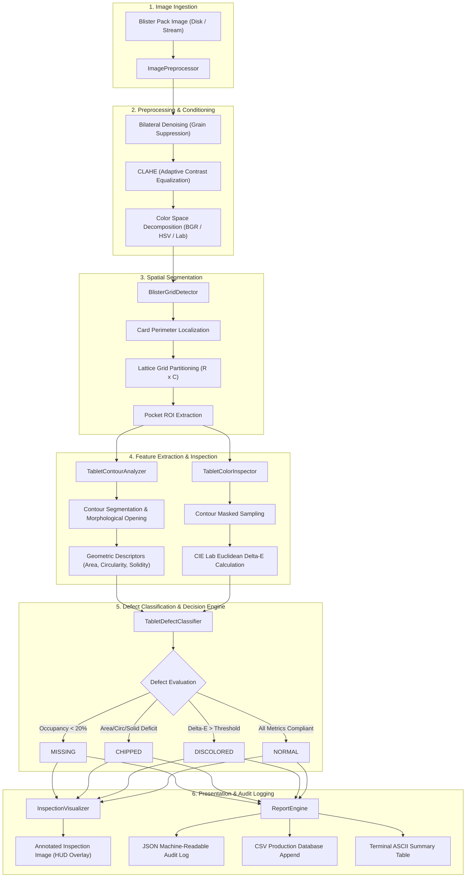
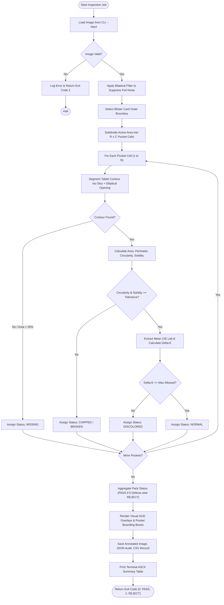
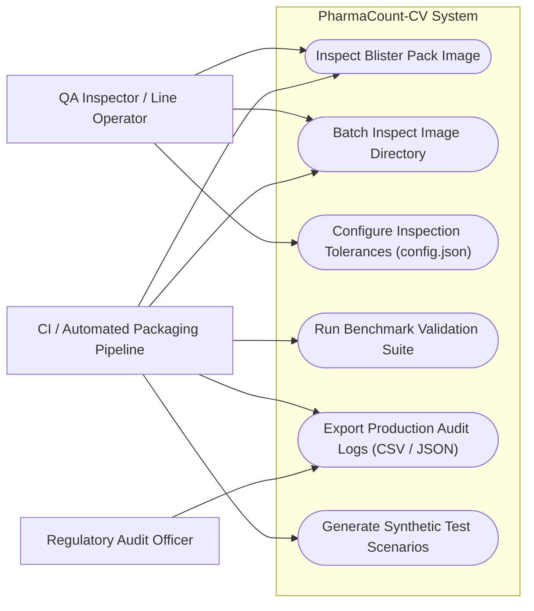
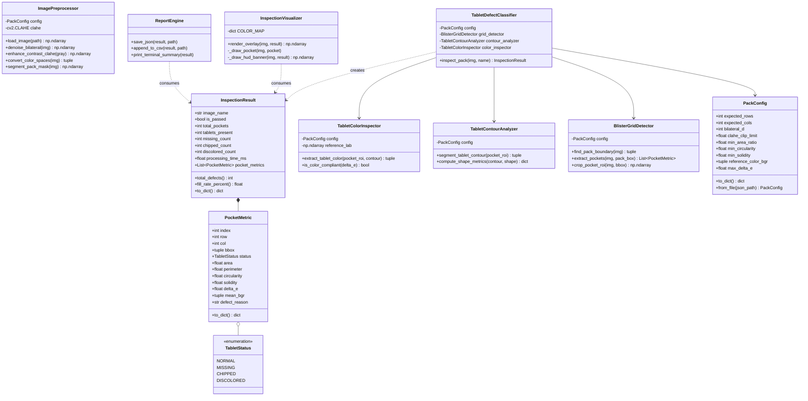
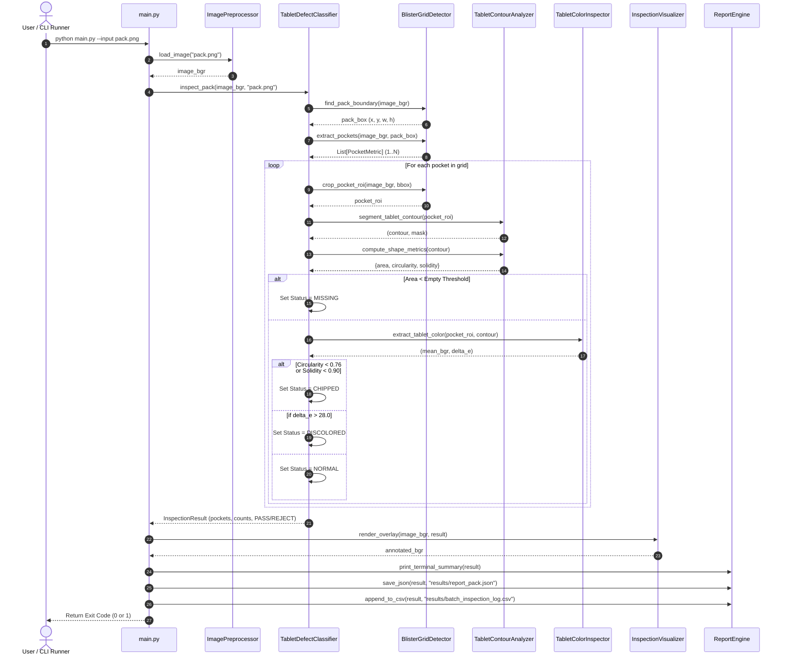

# PharmaCount-CV: System Architecture & UML Design Diagrams

This document contains formal software architecture and design diagrams for the **PharmaCount-CV** inspection system.

---

## 1. System Architecture Diagram



---

## 2. Process Flow / Workflow Diagram



---

## 3. UML Use Case Diagram



---

## 4. UML Class Diagram



---

## 5. UML Sequence Diagram (Single Inspection Run)



---

## 6. Storage & Database Schema Design (Production Audit Log)

For regulatory compliance (FDA 21 CFR Part 11 and CDSCO electronic audit standards), all inspection records are persisted across two structures:

### A. Relational Schema / CSV Production Table: `batch_inspection_log`

| Column Name | Data Type | Constraint | Description |
|:---|:---|:---|:---|
| `inspection_id` | `VARCHAR(36)` | PRIMARY KEY / UUID | Unique inspection transaction identifier |
| `timestamp_utc` | `DATETIME` | NOT NULL | ISO 8601 inspection timestamp |
| `image_name` | `VARCHAR(255)` | NOT NULL | Source image filename |
| `overall_status` | `VARCHAR(10)` | CHECK IN ('PASS', 'REJECT') | Batch acceptance decision |
| `total_pockets` | `INT` | NOT NULL, >= 1 | Configured pocket count |
| `tablets_present` | `INT` | NOT NULL, >= 0 | Tablets detected inside pockets |
| `fill_rate_percent`| `DECIMAL(5,2)` | 0.00 to 100.00 | Packaging fill percentage |
| `total_defects` | `INT` | NOT NULL, >= 0 | Total anomalous pockets |
| `missing_count` | `INT` | NOT NULL, >= 0 | Empty pockets count |
| `chipped_count` | `INT` | NOT NULL, >= 0 | Broken/chipped tablets count |
| `discolored_count`| `INT` | NOT NULL, >= 0 | Foreign/degraded tablets count |
| `latency_ms` | `DECIMAL(6,2)`| NOT NULL | Total computer vision processing latency |

### B. Hierarchical Audit Record: `report_{image_name}.json`

```json
{
  "image_name": "sample_03_chipped_tablet.png",
  "overall_status": "REJECT",
  "summary": {
    "total_pockets": 10,
    "tablets_present": 10,
    "fill_rate_percent": 100.0,
    "total_defects": 1,
    "missing_count": 0,
    "chipped_count": 1,
    "discolored_count": 0,
    "processing_time_ms": 23.4
  },
  "pockets": [
    {
      "index": 1,
      "grid_position": { "row": 1, "col": 1 },
      "bounding_box": { "x": 68, "y": 48, "w": 88, "h": 88 },
      "status": "NORMAL",
      "area_px": 3216.5,
      "perimeter_px": 204.2,
      "circularity": 0.884,
      "solidity": 0.985,
      "color_delta_e": 3.8,
      "mean_bgr": [238.1, 238.4, 239.0],
      "defect_reason": "Compliant"
    },
    {
      "index": 3,
      "grid_position": { "row": 1, "col": 3 },
      "bounding_box": { "x": 268, "y": 48, "w": 88, "h": 88 },
      "status": "CHIPPED",
      "area_px": 2410.0,
      "perimeter_px": 218.4,
      "circularity": 0.635,
      "solidity": 0.812,
      "color_delta_e": 4.1,
      "mean_bgr": [237.5, 237.9, 238.2],
      "defect_reason": "Low circularity (0.64); Low solidity (0.81)"
    }
  ]
}
```
