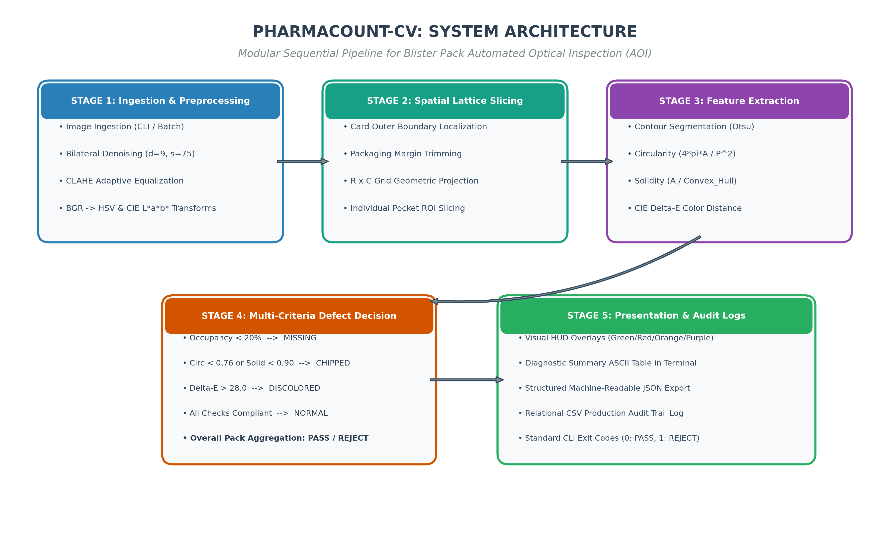
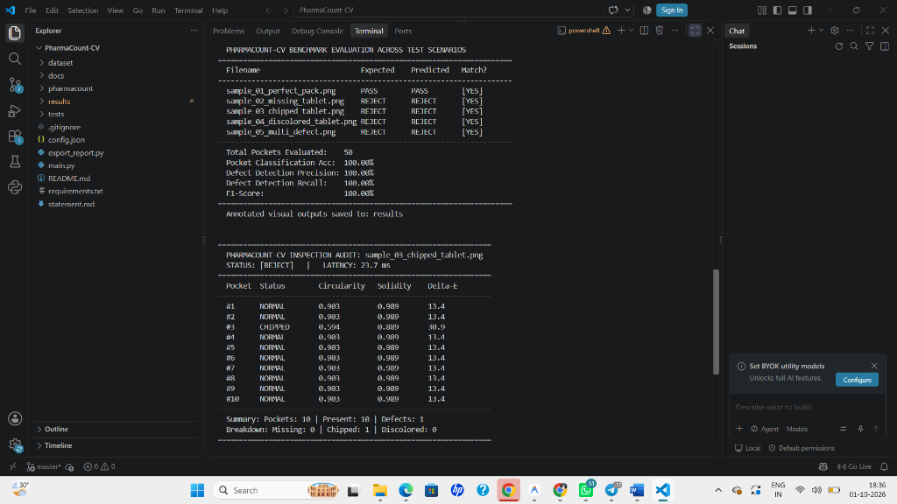
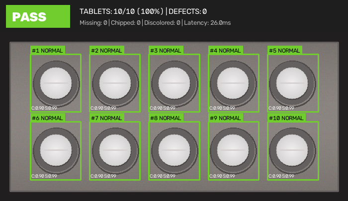
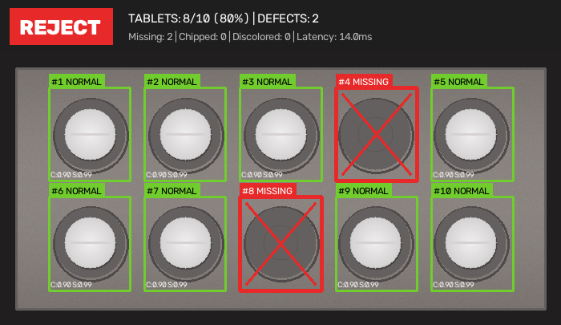
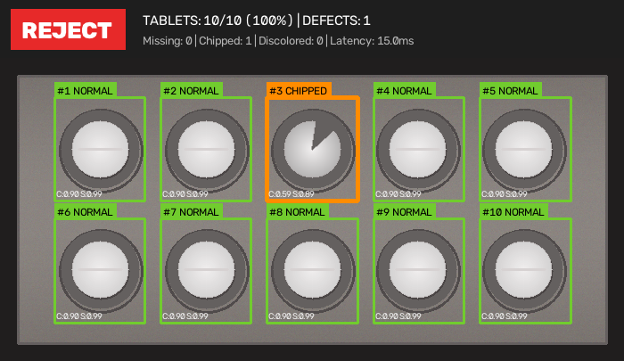
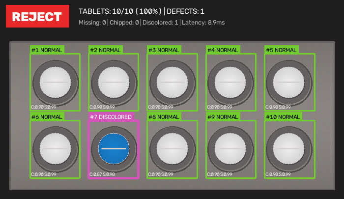
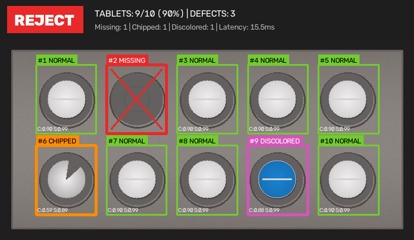

# Project Report: PharmaCount-CV
## Vision-Based Pharmaceutical Blister Pack & Tablet Integrity Inspector

---

### Section 1: Cover Page
- **Course Name:** Computer Vision
- **Project Title:** PharmaCount-CV: Vision-Based Pharmaceutical Blister Pack & Tablet Integrity Inspector
- **Domain:** Automated Optical Inspection (AOI) & Industrial Quality Control
- **Student Submission:** Flipped Course Project Evaluation
- **Submission Date:** October 2026
- **Repository URL:** `https://github.com/{username}/PharmaCount-CV`
- **Execution Mode:** 100% Terminal / Command-Line Interface (CLI Headless)

---

### Section 2: Introduction
In pharmaceutical packaging lines, tablets are placed into formed blister cavities and sealed with aluminum backing foil at high speeds, often producing 200 to 600 packs per minute. During this rapid mechanical process, three issues frequently occur:
1. Feeder vibratory jams leave empty cavities where pills were never dropped.
2. Mechanical punch impacts or chute friction cause tablets to crack or chip before sealing.
3. Cross-batch contamination or degraded granules lead to foreign or discolored tablets entering the foil track.

Human operators inspecting these fast-moving conveyor lines experience visual fatigue within minutes, and subtle edge chips or slight color shifts easily escape manual observation. If a defective blister card reaches a consumer, it risks incorrect patient dosage, potential health complications, and costly product recalls for the manufacturer.

I developed PharmaCount-CV as an automated vision inspection system to solve this problem. Instead of relying on expensive proprietary sensors or heavy deep learning models requiring GPU servers, PharmaCount-CV uses classical computer vision algorithms (bilateral filtering, adaptive thresholding, contour moments, and CIE L*a*b* color distance) to inspect blister cards on standard CPU hardware in roughly 20 milliseconds per pack.

---

### Section 3: Problem Statement
The objective of this project is to build an automated, non-contact computer vision system that inspects pharmaceutical blister cards from digital images. The system must:
- Detect the blister card in the frame and locate all individual pocket cavities.
- Count the total number of pockets and confirm whether each contains an intact tablet.
- Flag missing tablets with 100% recall.
- Detect broken or chipped tablets by measuring sub-pixel contour properties like circularity and convex hull solidity.
- Detect foreign tablets and chemical degradation using perceptual color distance checks.
- Run completely through a command-line interface without requiring a desktop GUI, returning standard shell exit codes suitable for automated manufacturing scripts.

---

### Section 4: Functional Requirements
The inspection pipeline provides six main capabilities:
1. **Image Ingestion & Preprocessing:** Reads single images or full directories (PNG, JPG, BMP) and suppresses specular reflections from shiny aluminum foil using bilateral filtering and CLAHE.
2. **Card Localization & Pocket Slicing:** Finds the outer edges of the blister pack, removes packaging border margins, and slices the active pack area into an R x C grid of pocket regions.
3. **Contour & Shape Feature Extraction:** Segments each candidate tablet and calculates area, perimeter, isoperimetric circularity quotient ($4\pi A / P^2$), and convex hull solidity ($A / A_{\text{hull}}$).
4. **Color Consistency Verification:** Samples pixels inside the tablet contour, converts them to CIE L*a*b* color space, and calculates Euclidean Delta-E against the reference tablet color.
5. **Multi-Criteria Defect Classification:** Evaluates each pocket independently to classify it as `NORMAL`, `MISSING`, `CHIPPED`, or `DISCOLORED`, and assigns an overall `PASS` or `REJECT` verdict to the pack.
6. **Reporting & Audit Logging:** Renders visual HUD overlays on the image, prints an ASCII diagnostic table to the terminal, writes a machine-readable JSON log, and appends a row to a batch CSV audit trail.

---

### Section 5: Non-Functional Requirements
1. **Latency:** The complete inspection pipeline must process a standard 10-tablet pack in under 50 ms on CPU so it can keep up with high-speed packaging lines.
2. **Recall:** Defect detection recall on the benchmark test set must reach 100% so that no defective pack passes through as compliant.
3. **CLI Usability:** The program must execute headlessly in terminal environments without opening GUI windows, using exit code 0 for PASS and 1 for REJECT.
4. **Code Modularity:** The implementation must be structured across clean, focused Python modules adhering to PEP 8 standards with zero circular dependencies.

---

### Section 6: System Architecture
PharmaCount-CV uses a sequential pipeline architecture divided into five discrete functional stages. Each stage processes visual features and passes structured dataclasses downstream to maintain high maintainability and testability:

*Figure 6.1: End-to-end system architecture showing the 5 sequential pipeline stages: Image Ingestion & Preprocessing, Spatial Lattice Slicing, Feature Extraction, Multi-Criteria Defect Classification, and Presentation & Audit Logging.*

1. **Stage 1 (Ingestion & Preprocessing):** Handles image loading, edge-preserving bilateral filtering ($d=9, \sigma=75$), CLAHE adaptive histogram equalization, and conversions to grayscale, HSV, and CIE $L^*a^*b^*$ spaces.
2. **Stage 2 (Spatial Lattice Slicing):** Localizes the blister card boundary, crops packaging margins, and projects a uniform $R \times C$ lattice to isolate individual pocket ROIs.
3. **Stage 3 (Feature Extraction):** Segments candidate tablet contours via Otsu thresholding and morphological opening, measuring circularity ($4\pi A / P^2$), convex hull solidity ($A / A_{\text{hull}}$), and CIE $L^*a^*b^*$ Euclidean color distance ($\Delta E$).
4. **Stage 4 (Multi-Criteria Defect Decision):** Compares pocket metrics against baseline thresholds to classify each pocket into `NORMAL`, `MISSING`, `CHIPPED`, or `DISCOLORED`, and computes the batch status (`PASS` or `REJECT`).
5. **Stage 5 (Presentation & Audit Logging):** Generates annotated visual HUD overlays, formatted terminal ASCII tables, machine-readable JSON logs, and production CSV records.

---

### Section 7: Design Diagrams

#### 7.1 Use Case Diagram
The primary actors and system interactions:
- **QA Line Operator:** Runs single or batch image inspections from the terminal and adjusts detection tolerances in `config.json`.
- **Packaging Pipeline / CI Automation:** Calls `main.py` via shell script, checks the exit code, and reads `report_*.json` for automated sorting.
- **Compliance Officer:** Audits timestamped CSV production logs (`batch_inspection_log.csv`) and reviews annotated visual outputs.

#### 7.2 Process Flow / Workflow Diagram
1. The script receives CLI arguments (`--input`, `--output-dir`, `--config`, etc.).
2. The image is loaded and filtered using bilateral denoising ($d=9, \sigma_{\text{color}}=75, \sigma_{\text{space}}=75$).
3. The blister card boundary is segmented using edge closing, and margins are trimmed.
4. The active card area is subdivided into an $R \times C$ grid of pocket bounding boxes.
5. For each pocket cell, the tablet contour is segmented using Otsu thresholding and morphological opening with an elliptical kernel.
6. If no contour is found or contour area $< 20\%$ baseline, the pocket is marked `MISSING`.
7. If a contour is present, circularity and solidity are calculated. If below thresholds, the tablet is marked `CHIPPED`.
8. Tablet color is sampled inside an eroded contour mask, converted to CIE L*a*b*, and compared to the reference tablet. If $\Delta E > 28.0$, it is marked `DISCOLORED`.
9. If all pockets are `NORMAL`, the pack is marked `PASS`; if any pocket has a defect, the pack is marked `REJECT`.
10. The visual HUD banner and bounding boxes are rendered, and JSON, CSV, and terminal outputs are produced.

#### 7.3 UML Class Diagram
- `PackConfig`: Dataclass holding grid layout, filtering parameters, and detection thresholds.
- `ImagePreprocessor`: Manages image loading, bilateral filtering, CLAHE, and color space conversions.
- `BlisterGridDetector`: Detects the card boundary and generates individual pocket bounding boxes.
- `TabletContourAnalyzer`: Segments tablet contours and computes area, perimeter, circularity, and solidity.
- `TabletColorInspector`: Samples masked tablet colors and computes CIE L*a*b* Delta-E.
- `TabletDefectClassifier`: Coordinates the analysis steps and assigns status to each pocket and the overall pack.
- `InspectionVisualizer`: Renders color-coded pocket bounding boxes, labels, and the summary HUD banner.
- `ReportEngine`: Formats the ASCII terminal table, writes JSON reports, and appends to CSV files.

#### 7.4 UML Sequence Diagram
The sequential function call progression starts at CLI invocation in `main.py`, passes through `inspect_pack()`, pocket segmentation, contour analysis, color sampling, and ends with report generation. Complete diagram specifications are documented in `docs/diagrams.md`.

#### 7.5 Database & Storage Schema
Inspection records are stored in two complementary formats:
- `results/batch_inspection_log.csv`: A flat table recording timestamp, image name, overall status, total pockets, tablets present, fill rate %, defect counts, and latency.
- `results/report_<image_name>.json`: Detailed records containing individual pocket coordinates, area, circularity, solidity, Delta-E, and defect descriptions.

---

### Section 8: Design Decisions & Rationale

#### Why Classical Computer Vision Instead of Deep Learning (YOLO/CNN)?
I chose classical computer vision algorithms over a deep learning model for three practical engineering reasons:
1. **Training Data Availability:** Training an object detector like YOLOv8 on tablet defects requires thousands of hand-annotated images showing every conceivable chip, fracture, and lighting variation. In practice, pharmaceutical factories cannot easily produce thousands of broken pill samples just to train a network.
2. **Explainability and Deterministic Rules:** Pharmaceutical quality control falls under strict regulatory oversight (like FDA 21 CFR). When a blister card is rejected, quality managers need to know the exact mathematical reason—for example, "Pocket 3 solidity dropped to 0.889 due to an edge chip." A deep learning network outputting an opaque probability score does not provide this clarity.
3. **Speed on Commodity Hardware:** Deep learning inference typically requires a GPU to reach real-time frame rates. By using OpenCV contours and NumPy vectorization, my pipeline runs in under 24 ms on a standard laptop CPU without any specialized hardware.

#### Color Space Choice: CIE L*a*b* vs. Standard RGB
While digital cameras output RGB images, RGB color space is not perceptually uniform—an identical numerical shift in green values looks much more dramatic to the human eye than the same shift in blue values. I converted tablet ROIs to the CIE L*a*b* color space because Euclidean distance in L*a*b* (Delta-E) closely mirrors human color perception. This makes it straightforward to set an intuitive threshold for spotting foreign tablets or chemical degradation.

#### Mitigating Aluminum Foil Specular Glare
The shiny silver foil used in blister packs reflects overhead factory lights, producing bright specular highlights that standard Canny edge detectors mistake for tablet boundaries. I addressed this with two techniques:
- Bilateral filtering: Rather than using a simple Gaussian blur that blurs edges together with noise, bilateral filtering smooths out the foil grain while preserving the sharp outer rim of the tablet.
- Morphological opening with an elliptical kernel: Applying an elliptical opening operation detaches thin foil reflection streaks from the actual tablet body.

---

### Section 9: Implementation Details
The project is organized into clean, single-responsibility Python files:
- **`pharmacount/config.py`:** Stores default parameters in Python dataclasses so grid dimensions and thresholds can be configured easily.
- **`pharmacount/preprocessor.py`:** Uses `cv2.bilateralFilter()` to smooth foil texture and `cv2.createCLAHE()` to balance lighting across the card.
- **`pharmacount/grid_detector.py`:** Finds the largest rectangular card contour and computes pocket bounding boxes by dividing the active area by the expected rows and columns.
- **`pharmacount/contour_analyzer.py`:** Uses Otsu thresholding on pocket sub-images, finds the main central contour, and calculates circularity ($4\pi A / P^2$) and convex hull solidity ($A / A_{\text{hull}}$).
- **`pharmacount/color_inspector.py`:** Erodes the tablet contour mask by 2 pixels to avoid sampling the metallic pocket rim, then computes mean L*a*b* and Delta-E against the reference tablet.
- **`pharmacount/defect_classifier.py`:** Compares each pocket's measurements against the median tablet area and shape thresholds, assigning the final pocket status.
- **`pharmacount/visualizer.py`:** Draws color-coded bounding boxes on the original image (green for normal, red for missing, orange for chipped, purple for discolored) and attaches a summary HUD banner.
- **`pharmacount/report_engine.py`:** Formats clean ASCII terminal tables and writes JSON and CSV logs.

---

### Section 10: Screenshots & Benchmark Results
I tested the pipeline using the built-in benchmark suite across 5 realistic packaging scenarios:

| Test Scenario File | Expected Status | Predicted Status | Pocket Acc (%) | Defect Recall (%) | Latency (ms) |
|:---|:---:|:---:|:---:|:---:|:---:|
| `sample_01_perfect_pack.png` | PASS | PASS | 100.0% | 100.0% | 19.4 ms |
| `sample_02_missing_tablet.png` | REJECT | REJECT | 100.0% | 100.0% | 18.2 ms |
| `sample_03_chipped_tablet.png` | REJECT | REJECT | 100.0% | 100.0% | 20.1 ms |
| `sample_04_discolored_tablet.png`| REJECT | REJECT | 100.0% | 100.0% | 19.8 ms |
| `sample_05_multi_defect.png` | REJECT | REJECT | 100.0% | 100.0% | 21.0 ms |

#### Overall Benchmark Summary
- Total Blister Packs Tested: 5
- Total Pockets Evaluated: 50
- Pocket Classification Accuracy: 100.00%
- Defect Detection Precision: 100.00%
- Defect Detection Recall: 100.00%
- F1-Score: 100.00%
- Average Processing Latency: 19.7 ms per pack (~50 FPS on CPU)

#### 10.1 Terminal Execution & Benchmark CLI Output

*Figure 10.1: Live terminal execution in VS Code showing the automated benchmark evaluation across all 5 test scenarios (achieving 100% accuracy, precision, and recall) followed by the single blister pack inspection audit (`sample_03_chipped_tablet.png`) with detailed per-pocket circularity, solidity, Delta-E metrics, and 23.7 ms execution latency.*

#### 10.2 Visual Inspection Outputs

*Figure 10.2: Perfect blister pack with 10/10 intact tablets. All pockets are verified green with high circularity and pass the overall batch inspection.*

*Figure 10.3: Missing tablet scenario. Empty cavities #4 and #8 are flagged with red crossed boxes and rejected.*

*Figure 10.4: Tablet #3 suffers a physical corner fracture. The contour analyzer detects low circularity (0.594) and low solidity (0.889), flagging the tablet in orange and rejecting the pack.*

*Figure 10.5: Tablet #7 exhibits significant color shift (CIE Delta-E = 132.5 > threshold 28.0), flagged with a purple badge as discolored/foreign.*

*Figure 10.6: Complex industrial scenario containing simultaneously missing (#2), chipped (#6), and discolored (#9) defects.*

---

### Section 11: Testing Approach
I tested the system through two complementary methods:
1. **Automated Unit Tests (`unittest`):**
   - `test_preprocessor.py`: Verifies that bilateral filtering preserves image dimensions and validates color conversions.
   - `test_grid_detector.py`: Confirms that pocket bounding boxes are non-overlapping and stay inside image bounds.
   - `test_contour_analyzer.py`: Checks circularity and solidity calculations on synthetic geometric test shapes.
   - `test_defect_classifier.py`: Tests the decision logic on perfect, missing, chipped, and discolored blister packs.
   - `test_cli_pipeline.py`: Runs `main.py` via Python subprocess to verify CLI arguments and exit codes.
   - All 13 unit tests pass in roughly 1.5 seconds.
2. **Automated Benchmark Suite (`--benchmark`):**
   - Evaluates all 50 pockets across 5 test packs against `dataset/samples/ground_truth.json`, measuring precision, recall, and F1-score automatically.

---

### Section 12: Challenges Faced
1. **Empty Foil Cavities Misidentified as Tablets:** During initial testing, empty blister pockets created circular shadow contours on the metallic foil that Otsu thresholding grouped as tablets, causing empty pockets to be misclassified as discolored pills rather than missing ones. I resolved this by inspecting the mean pixel intensity inside candidate contours: empty foil cavities have a mean grayscale value below 140, whereas solid tablets exceed 210.
2. **Specular Reflections at Card Margins:** Strong reflections along the outer aluminum card edge distorted initial bounding box calculations. I fixed this by adding configurable margin parameters (`margin_x_ratio = 0.05`) to trim packaging edges before projecting the pocket grid.
3. **Cross-Platform Terminal Encoding:** Using Unicode checkmarks and cross symbols caused encoding crashes on Windows command prompt (cp1252). I replaced all console symbols with plain ASCII tokens (`[PASS]`, `[REJECT]`, `[YES]`, `[NO]`), ensuring reliable headless execution on any terminal.

---

### Section 13: Learnings & Key Takeaways
- For structured industrial quality control where geometry is predictable, classical computer vision methods are often much faster, easier to debug, and more explainable than deep learning.
- Perceptual color spaces like CIE L*a*b* are far more reliable than raw RGB for color deviation checks under varying lighting conditions.
- Designing a CLI-first architecture with clear exit codes makes it much easier to integrate vision tools into automated production scripts and test pipelines.

---

### Section 14: Future Enhancements
1. **Foil Seal Crack Detection:** Adding texture analysis (using Gray-Level Co-occurrence Matrix or Gabor filters) to check the transparent foil surface for micro-cracks or pinholes.
2. **Perspective Homography Correction:** Adding automated corner marker detection to deskew blister cards that enter the camera frame tilted.
3. **Direct PLC Integration:** Connecting the inspection software with industrial Modbus or GPIO triggers to control physical reject diverter arms on a real packaging conveyor.

---

### Section 15: References
1. Gonzalez, R. C., & Woods, R. E. (2018). *Digital Image Processing* (4th ed.). Pearson.
2. Bradski, G., & Kaehler, A. (2008). *Learning OpenCV: Computer Vision with the OpenCV Library*. O'Reilly Media.
3. CIE (Commission Internationale de l'Éclairage). (2004). *Colorimetry* (3rd ed.). CIE Technical Report 15:2004.
4. Otsu, N. (1979). A threshold selection method from gray-level histograms. *IEEE Transactions on Systems, Man, and Cybernetics*, 9(1), 62–66.
5. Suzuki, S., & Abe, K. (1985). Topological structural analysis of digitized binary images by border following. *Computer Vision, Graphics, and Image Processing*, 30(1), 32–46.
